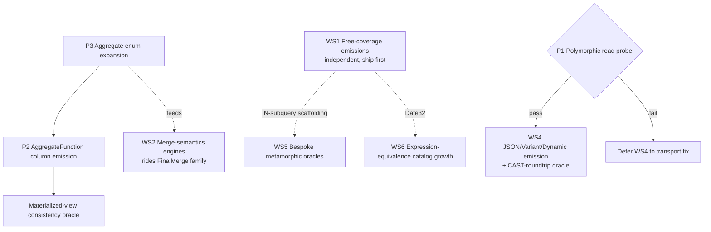

# feat: ClickHouse coverage expansion roadmap — close highest-value SQLancer feature gaps

## Overview

SQLancer's ClickHouse provider is mature (112 Java files, ~28 oracles), but a structured
audit of *what ClickHouse features the fuzzer generates and tests* against ClickHouse's actual
feature surface (~26.x head) found ~20 coverage gaps. The striking pattern: several oracles and
AST nodes are **already written but dormant** because the schema/expression generators never
emit the types, engines, or clauses that would feed them. The highest-value work is therefore
not new oracles — it is closing small generator gaps so existing invariants start doing work.

This roadmap closes the gaps in six dependency-ordered workstreams, front-loading the
"free-coverage" emissions (an existing oracle fires the instant a type/clause is emitted) and
deferring the bespoke-oracle and transport-gated work.

This plan is a **planning artifact**: it captures decisions, file targets, and test/verification
scenarios. It does not pre-write generator or oracle code.

## Problem Frame

The provider has accreted rich modelling ahead of emission:

- `ClickHouseType.java` models ~25 type constructors, but `ClickHouseSchema`'s scalar picker
  emits only a narrow `Kind` subset — `Date32`, `UInt16`, `UInt128/256`, `IPv4/IPv6`, `UUID`,
  and the polymorphic types (`JSON`/`Variant`/`Dynamic`/`Tuple`/`Map`) are **never picked as
  columns** despite having literal emitters (UUID/IPv4/IPv6 literals even throw
  `IgnoreMeException` at `ClickHouseExpressionGenerator.java:1134` under a comment admitting
  emission "is feasible").
- `ClickHouseSelect` carries `limitClause`/`offsetClause` fields with setters that the visitor
  **never renders** (dead fields).
- `DETERMINISTIC_JOIN_TYPES` emits ANTI joins but deliberately excludes ANY/SEMI.
- `AggregateStateRoundtripOracle` and `DynamicSubcolumnOracle` are **registered but dormant** —
  the type picker never builds the `AggregateFunction`/`Dynamic` columns they target.
- The engine pool is MergeTree/Replacing/Summing only; Collapsing/VersionedCollapsing/
  Aggregating (the highest-bug-density merge paths) are absent, yet `supportsFinal()` already
  whitelists them so `FinalMerge`/`Optimizing`/`PartitionMirror` would fire on emission.
- The aggregate enum carries only avg/count/max/min/sum — ~5 of ClickHouse's ~150 aggregates —
  and five oracles consume it directly.

The goal: rank gaps by bug-finding value × tractability and close them in an order that banks
quick wins, respects soundness (some surfaces break the TLP/NoREC partition invariant and need
bespoke oracles), and sequences the three cross-cutting prerequisites correctly.

## Requirements Trace

- **R1.** Expand the generated feature surface so existing under-fed oracles (TLPWhere, NoREC,
  SEMR, CODDTest, KeyCondition, PartitionMirror) exercise more of ClickHouse with zero new oracle
  code wherever possible.
- **R2.** Activate the already-registered dormant oracles (`AggregateStateRoundtrip`,
  `DynamicSubcolumn`) by closing the generator gaps that starve them.
- **R3.** Add the merge-semantics engines (Collapsing/VersionedCollapsing/Aggregating) that feed
  the `FinalMerge` oracle family — the cluster adjacent to the SummingMergeTree FINAL row-drop bug
  already in institutional memory.
- **R4.** Expand the aggregate-function catalog to a deterministic, multiset-comparable subset
  that five oracles consume directly.
- **R5.** Add bespoke metamorphic oracles for high-value SELECT/function surfaces where the
  TLP/NoREC partition invariant provably breaks (GROUP BY super-aggregation, ANY/SEMI joins,
  LIMIT WITH TIES, window frames).
- **R6.** Grow the expression-equivalence catalogs (EET identities, CODDTest monotonic transforms,
  KeyCondition pruning) with high-value function families.
- **R7.** Preserve existing oracle soundness throughout — non-deterministic constructs (uniq,
  non-Exact quantile, topK, ANY/SEMI, super-aggregation, window) must be steered out of the
  multiset/TLP oracles and routed only to oracles designed for them.

## Scope Boundaries

- **Not** rewriting the transport, type ADT, or oracle framework — only closing emission gaps and
  adding oracles that ride existing scaffolding.
- **Not** adding Log-family, Distributed/Replicated, or external-table (S3/URL/File) engines —
  they lack the part/merge/pruning surface that drives the high-value oracles, and Distributed
  needs cluster topology this single-node harness does not model.
- **Not** chasing ClickHouse's full ~150-aggregate / thousands-of-scalar-function catalog — only
  the deterministic, oracle-checkable, historically-buggy subset.
- **Not** filing the candidate CH bugs already in institutional memory (negdiv intDiv pruning,
  SummingMergeTree FINAL row-drop) — those are tracked separately; this plan only adds generator/
  oracle reach that would catch *more* of that class.
- Reproducer-only session settings stay in **server config**, not per-table DDL (see institutional
  learnings).

## Context & Research

### Audit method

Six parallel dimension-finders read the actual generator/oracle source and cross-referenced
against ClickHouse's current feature surface, then a synthesis pass ranked and grouped the gaps.
Raw findings: workflow run `wf_b98fa133-d62` (transcript under the session's `workflows/` dir).
The top-ranked claims (PRIMARY KEY TODO, narrow scalar picker, IgnoreMe'd IP/UUID literals,
ANY/SEMI exclusion, unrendered LIMIT/OFFSET, MergeTree-only engine pool) were spot-verified by
static grep before this plan was written.

### Relevant Code and Patterns

- **Scalar type picker:** `src/sqlancer/clickhouse/ClickHouseSchema.java` (`pickScalarType`) —
  the single chokepoint that decides which `Kind`s become columns.
- **Type ADT + literal emitters:** `src/sqlancer/clickhouse/ClickHouseType.java`,
  `src/sqlancer/clickhouse/gen/ClickHouseExpressionGenerator.java`
  (`generatePrimitiveConstant`, line ~1134 IgnoreMe escape hatch).
- **Table/engine generator:** `src/sqlancer/clickhouse/gen/ClickHouseTableGenerator.java`
  (`ClickHouseEngine` enum line 31, `pickEngine`, `start` — PRIMARY KEY TODO at line 262, SETTINGS
  append site).
- **Engine FINAL whitelist:** `src/sqlancer/clickhouse/ClickHouseSchema.java`
  (`ClickHouseTable.supportsFinal`) — already admits the merge-semantics engines.
- **Aggregate enum + combinators:** `src/sqlancer/clickhouse/ast/ClickHouseAggregate.java`,
  `src/sqlancer/clickhouse/ast/ClickHouseAggregateCombinator.java`,
  `src/sqlancer/clickhouse/oracle/tlp/ClickHouseCombinatorIdentities.java`.
- **Dormant oracles:** `src/sqlancer/clickhouse/oracle/aggstate/ClickHouseAggregateStateRoundtripOracle.java`,
  `src/sqlancer/clickhouse/oracle/dynamicsub/ClickHouseDynamicSubcolumnOracle.java`.
- **Reusable oracle scaffolding:** `ClickHouseViewEquivalenceOracle` (create/read/drop),
  `ClickHousePartitionMirrorOracle` (partition enumeration + PRIMARY KEY regex),
  `ClickHouseEETIdentities` / `ClickHouseEETOracle` (identity-catalog runner),
  `ClickHouseDictGetVsJoinOracle` (dictGet==JOIN invariant),
  `ClickHouseWindowEquivalenceOracle` (window rewrite host).
- **Transport read path:** `src/sqlancer/clickhouse/transport/ClickHouseRowBinaryParser.java`
  (`getString(int)`) — the probe target for WS4.
- **Tests:** `test/sqlancer/clickhouse/` (e.g. `ClickHouseTypeGenerationTest`,
  `ast/ClickHouseToStringVisitorTest`, `ast/ClickHouseBinaryComparisonOperationTest`).

### Institutional Learnings (from MEMORY + provider CLAUDE.md)

- **TLPGroupBy/TLPAggregate are not sound under arbitrary projections / super-aggregation** —
  this is *why* WS5 builds bespoke metamorphic oracles instead of feeding ROLLUP/CUBE into TLP.
- **Engine pool is intentionally schema-aware** (dedupe engines need a valid ver/sum column and a
  bare-column ORDER BY) — WS2's Collapsing engines must follow the same `isValid*` gating to avoid
  the 2026-05-20 non-determinism false-positive cluster.
- **SummingMergeTree FINAL column-pruning row-drop** and **negative-divisor intDiv partition
  pruning** are real candidate bugs already found — WS2 (merge engines) and WS6 (date transforms +
  pruning) directly widen the net for that class.
- **Multiset oracles materialize full result sets**; non-deterministic aggregates/joins inflate
  false positives — R7 gating is mandatory, not optional.
- **Reproducer settings belong in server config**, not per-table DDL.

### External References

- None required: this is internal-fuzzer-architecture work; ClickHouse feature semantics are
  established knowledge and the synthesis already cited the relevant CH bug shapes (#103052 /
  #88350 projections, #99431 / #100029 ANY/SEMI joins, #104781 query-condition cache,
  #106080-cluster materialization). Verify specific version behavior at implementation time
  against the local head container, not in this plan.

## Key Technical Decisions

- **Sequence by value-per-effort, not by subsystem.** Ship WS1 "free coverage" first: each item is
  a small generator edit that an existing oracle invariant immediately exercises. This banks wins
  and de-risks the harness (e.g. confirms wide-int/IP/UUID round-trip cleanly through client-v2)
  before the oracle-heavy workstreams.
- **Reuse the FINAL whitelist rather than build a new merge oracle.** `supportsFinal()` already
  admits Collapsing/VersionedCollapsing/Aggregating, so emitting them is pure `pickEngine`/
  `renderEngineArgs` work; `FinalMerge`/`Optimizing`/`PartitionMirror` fire for free.
- **The aggregate enum is the single highest-leverage multiplier.** Expand it first within WS3 —
  five oracles consume `getRandom()` directly, so deterministic additions get five oracles working
  with zero oracle plumbing. Gate non-deterministic aggregates out of multiset oracles (R7).
- **Treat the polymorphic-read path as a probe-gated risk (WS4).** Verify `getString` renders a
  composite column as a stable comparable string *before* committing to JSON/Variant/Dynamic
  emission. If the probe fails, WS4 is deferred to a transport fix — it must not block WS1–3/5/6.
- **Bespoke oracles only where TLP provably breaks (WS5).** Super-aggregation, ANY/SEMI joins,
  LIMIT, and window functions break the partition invariant; each gets a dedicated decomposition/
  differential oracle, never the TLP/NoREC harness.
- **Grow catalogs, don't grow harnesses, in WS6.** multiIf/string/date-transform identities drop
  into the existing EET/CODDTest/KeyCondition runners as data, not new oracle classes.

## Open Questions

### Resolved During Planning

- *Which engines to add?* Collapsing + VersionedCollapsing + Aggregating only (already
  FINAL-whitelisted, high merge-bug density). Log/Distributed/external excluded (scope boundary).
- *Feed ROLLUP/CUBE into TLP?* No — institutional learning says TLP is unsound under
  super-aggregation; WS5 builds a decomposition oracle instead.
- *Are UUID/IPv4/IPv6 literals actually blocked?* No — verified the `IgnoreMeException` is gated
  by a stale rationale; client-v2's `getString` handles them. Safe to enable (WS1, U1.2).

### Deferred to Implementation

- **P1 — Polymorphic read probe (gates WS4):** Does `ClickHouseRowBinaryParser.getString` render a
  `Dynamic`/`Variant`/`JSON`/`Tuple`/`Map` column as a stable, comparable string? Resolve by a
  one-off probe SELECT against the head container before WS4 emission work. Outcome decides whether
  WS4 proceeds or is deferred.
- **Exact `pickScalarType` roll arithmetic** for inserting new `Kind` branches without skewing the
  existing distribution — knowable only when editing the picker.
- **Which aggregates are deterministic enough** for multiset oracles on *this* CH head (e.g.
  `groupArray` ordering under parallel/FINAL) — confirm per-function against the head container
  during U3.1, steer the rest to non-multiset oracles.
- **Collapsing-engine ORDER BY / Sign-column gating** — reuse `isValidReplacingVer`/
  `isValidSummingCol` classifiers; exact validity predicate finalized when editing `pickEngine`.
- **ANY/SEMI differential rewrite fidelity** (SEMI→IN/EXISTS, ANY→groupwise-arbitrary) — the exact
  rewrite that holds across algorithms is an implementation-time discovery against real results.

## High-Level Technical Design

> *This illustrates the intended approach and is directional guidance for review, not
> implementation specification. The implementing agent should treat it as context, not code to
> reproduce.*

Workstream dependency graph (what unblocks what):

The only hard cross-workstream couplings: WS3's internal chain (enum → state columns → MV), WS4's
gate on the P1 probe, and two soft "scaffolding reuse" edges (WS1's IN-subquery rendering helps
WS5's SEMI→IN rewrite; WS1's Date32 lets WS6's date-transform pruning checks cover both Date and
Date32 ranges). Everything else is parallelizable.

## Implementation Units

### Phase 1 — WS1: Free-coverage generator emissions

- [x] **Unit 1.1: `IN` / `NOT IN` with a subquery as a WHERE predicate**

**Goal:** Emit `col IN (SELECT ...)` / `NOT IN` predicates so the optimizer's semijoin/set
rewrite, PREWHERE interaction, and KeyCondition/partition pruning get fuzzed — the single
highest value-per-effort gap.

**Requirements:** R1.

**Dependencies:** None. (Soft: its subquery-rendering scaffolding is reused by U5.3.)

**Files:**
- Modify: `src/sqlancer/clickhouse/ast/ClickHouseBinaryComparisonOperation.java` (add IN / NOT IN operators)
- Modify: `src/sqlancer/clickhouse/gen/ClickHouseExpressionGenerator.java` (build subquery RHS; reuse `generateScalarSubquery` scaffolding)
- Test: `test/sqlancer/clickhouse/ast/ClickHouseBinaryComparisonOperationTest.java`, `test/sqlancer/clickhouse/ast/ClickHouseToStringVisitorTest.java`

**Approach:** Render the RHS as a single-column `(SELECT c FROM t WHERE ...)` fragment via the
existing `ClickHouseRawText` path `generateScalarSubquery` already uses. The WHERE-partition
invariant is preserved, so TLPWhere/NoREC/SEMR exercise it unchanged — no oracle work.

**Patterns to follow:** `generateScalarSubquery` (subquery → `ClickHouseRawText`); existing
binary-comparison operator rendering in the ToString visitor.

**Test scenarios:**
- Happy path: `IN (SELECT …)` and `NOT IN (SELECT …)` render with correct parenthesization and a single-column projection.
- Edge case: empty-result subquery RHS renders valid SQL (`IN` over empty → no rows; `NOT IN` over empty → all rows) — assert string shape, semantics validated by oracle run.
- Edge case: subquery referencing a Nullable column — operator still renders (3-valued-logic correctness is the oracle's job, not the generator's).
- Integration: a TLPWhere/NoREC fuzz smoke run with IN-subquery enabled produces zero new false positives over a short window.

**Verification:** Unit tests assert rendered SQL; a short TLPWhere fuzz run shows IN-subquery
predicates in generated queries and no new oracle false positives.

- [x] **Unit 1.2: Emit Date32, wide unsigned ints, and IPv4/IPv6/UUID as columns**

**Goal:** Turn dead literal/type paths into real columns: `Date32`, `UInt16`, `UInt128`,
`UInt256`, `IPv4`, `IPv6`, `UUID`.

**Requirements:** R1.

**Dependencies:** None.

**Files:**
- Modify: `src/sqlancer/clickhouse/ClickHouseSchema.java` (`pickScalarType` — add roll branches)
- Modify: `src/sqlancer/clickhouse/gen/ClickHouseExpressionGenerator.java` (`generatePrimitiveConstant`: replace the `IgnoreMeException` at line ~1134 with `toUUID('…')` / `toIPv4('…')` / `toIPv6('…')` literal emission; wide-UInt already routes through `createIntConstant`)
- Test: `test/sqlancer/clickhouse/ClickHouseTypeGenerationTest.java`, `test/sqlancer/clickhouse/ClickHouseTypeTest.java`

**Approach:** Date32 reuses `randomDateLiteral` (already boundary-targeting) and `LowCardinality.canWrap` (already accepts it). UInt16/128/256 reuse `createIntConstant`. IPv4/IPv6/UUID need only literal cases. Keep the picker distribution shift small so existing-type coverage is not diluted.

**Patterns to follow:** existing `Kind` branches in `pickScalarType`; `randomDateLiteral`; the wide-int `createIntConstant` path.

**Test scenarios:**
- Happy path: each new `Kind` is selectable by the picker and renders a valid column DDL type string.
- Happy path: each new type emits a valid literal (`toUUID`/`toIPv4`/`toIPv6`/Date32 string/wide-int) parseable by CH.
- Edge case: Date32 literal at the 1900 and 2299 boundaries renders correctly (cross-type Date↔Date32 comparison is left to the oracles).
- Edge case: `LowCardinality(Date32)` and `Nullable(IPv4)` wrap correctly per `canWrap` rules.
- Error path: confirm no remaining `IgnoreMeException` path is reachable for the now-supported kinds.

**Verification:** Type-generation unit tests cover all 7 new kinds; a short fuzz run creates tables
with each and TLPWhere/partition-pruning queries run clean against the head container.

- [x] **Unit 1.3: Explicit PRIMARY KEY prefix + broader per-table SETTINGS**

**Goal:** Emit a PRIMARY KEY that is a strict prefix of ORDER BY, and widen per-table SETTINGS
(small `index_granularity`, sparse-serialization ratio, `enable_mixed_granularity_parts`) to vary
granule/mark layout — the surface KeyCondition mark selection reads.

**Requirements:** R1.

**Dependencies:** None. (Both edit `ClickHouseTableGenerator.start`; do together to avoid merge churn.)

**Files:**
- Modify: `src/sqlancer/clickhouse/gen/ClickHouseTableGenerator.java` (PRIMARY KEY TODO at line ~262; SETTINGS append site)
- Test: `test/sqlancer/clickhouse/ast/ClickHouseToStringVisitorTest.java` (or a TableGenerator-focused test)

**Approach:** When ORDER BY has ≥2 columns, sometimes emit `PRIMARY KEY (prefix)`. Append a small
randomized SETTINGS subset; keep `index_granularity` occasionally tiny (1–8) to maximize
granule-boundary pruning exposure. Reproducer-only settings stay in server config, not here.

**Patterns to follow:** existing ORDER BY rendering in `start`; the current fixed SETTINGS trio.

**Test scenarios:**
- Happy path: PK-prefix renders only when ORDER BY length permits; never longer than ORDER BY.
- Edge case: single-column ORDER BY emits no separate PRIMARY KEY.
- Edge case: `index_granularity=1` table is created and queried without error.
- Integration: KeyCondition/PartitionMirror oracles parse the emitted PRIMARY KEY (PartitionMirror's regex already recognizes it) and run clean.

**Verification:** Visitor/generator tests assert PK-prefix and SETTINGS shape; fuzz run shows
varied granule layouts feeding KeyCondition with no new false positives.

- [x] **Unit 1.4: Dictionary LAYOUT variety wired into dictGet-vs-JOIN**

**Goal:** Stop hardcoding `HASHED()`; drive the already-written but dead `RANGE_HASHED` /
`COMPLEX_KEY_HASHED` layouts through the existing `dictGet == JOIN` invariant.

**Requirements:** R1.

**Dependencies:** None.

**Files:**
- Modify: `src/sqlancer/clickhouse/oracle/dict/ClickHouseDictGetVsJoinOracle.java` (vary LAYOUT)
- Modify: `src/sqlancer/clickhouse/gen/ClickHouseDictionaryGenerator.java` (currently unused — wire it in)
- Test: existing dict oracle exercised via fuzz run (no dedicated unit test class today)

**Approach:** Have the oracle pick a layout from the generator; for RANGE_HASHED build a
range-keyed source and a range-boundary `dictGet`; the JOIN side mirrors the range predicate.

**Patterns to follow:** existing `ClickHouseDictGetVsJoinOracle` invariant; the dead
`ClickHouseDictionaryGenerator` layout enum.

**Test scenarios:**
- Happy path: HASHED, COMPLEX_KEY_HASHED, RANGE_HASHED each build a dictionary that `dictGet` and the equivalent JOIN agree on.
- Edge case: RANGE_HASHED boundary inclusivity and an out-of-range key both match between dictGet and JOIN.
- Edge case: composite (complex) key with 2+ key columns.

**Verification:** Fuzz run with the dict oracle shows all three layouts exercised and dictGet==JOIN
holds.

### Phase 2 — WS2: Merge-semantics engines

- [x] **Unit 2.1: CollapsingMergeTree + VersionedCollapsingMergeTree engines**

**Goal:** Add the two collapse engines to the pool; the FINAL oracle family fires automatically
(`supportsFinal()` already whitelists them).

**Requirements:** R1, R3.

**Dependencies:** None. (Soft: richer aggregates from U3.1 give Summing/Aggregating more to do, but Collapsing is independent.)

**Files:**
- Modify: `src/sqlancer/clickhouse/gen/ClickHouseTableGenerator.java` (`ClickHouseEngine` enum line 31; `pickEngine`; `renderEngineArgs`)
- Test: `test/sqlancer/clickhouse/ast/ClickHouseToStringVisitorTest.java` (engine rendering) + fuzz run

**Approach:** Collapsing needs a Sign `Int8` column; VersionedCollapsing adds a version column
(reuse `isValidReplacingVer` classifier). Gate eligibility exactly like the existing dedupe
engines — bare-column ORDER BY, valid sign/version column — to avoid the 2026-05-20
non-determinism false-positive class. Inserts must produce matching +1/−1 sign rows for collapse
to be observable.

**Patterns to follow:** existing `ReplacingMergeTree`/`SummingMergeTree` `pickEngine` gating and
`renderEngineArgs`; `isValidOrderByForDedupe`, `isValidReplacingVer`, `isValidSummingCol`.

**Test scenarios:**
- Happy path: Collapsing/VersionedCollapsing render with a valid Sign (and version) arg.
- Edge case: column list with no viable Sign/version column falls back to plain MergeTree (mirror the existing fallback).
- Edge case: ORDER BY is a bare column reference (no NaN-producing function) per dedupe rules.
- Integration: `FinalMerge` oracle (`count() FINAL` == `count()` after `OPTIMIZE FINAL`) runs clean on a collapsing table after multi-INSERT +1/−1 history.

**Verification:** Engine-render tests pass; a fuzz run with collapsing engines shows
`supportsFinal()` true more often and FinalMerge/PartitionMirror exercise them with no new
false positives.

- [x] **Unit 2.2: ALTER ADD/MATERIALIZE PROJECTION on a populated table + projection-equivalence oracle** *(emission landed — rides TLPWhere/NoREC/TLPDistinct; companion optimize_use_projections toggle-oracle landed as ClickHouseProjectionToggleOracle — asserts a projection-matching aggregate returns identical results under optimize_use_projections=0 vs =1, restricted to exact integer aggregates + non-float group keys to avoid float-sum-ordering non-determinism)*

**Goal:** Create the mixed materialized/unmaterialized projection regime (where #103052 /
#88350-class bugs live) by adding a projection to an already-populated multi-part table, and add
a cheap oracle toggling `optimize_use_projections`.

**Requirements:** R1, R5.

**Dependencies:** None (reuses existing mutation-barrier polling).

**Files:**
- Modify: `src/sqlancer/clickhouse/gen/ClickHouseAlterGenerator.java` (`AlterKind`: ADD_PROJECTION / MATERIALIZE_PROJECTION)
- Modify: `src/sqlancer/clickhouse/ClickHouseErrors.java` (`getAlterErrors` tolerances)
- Create: `src/sqlancer/clickhouse/oracle/projection/` (new oracle toggling `optimize_use_projections` / `force_optimize_projection` over a projection-matching aggregate)
- Test: fuzz run + a focused unit test on the new oracle's query construction

**Approach:** ALTER ADD PROJECTION then MATERIALIZE on a multi-INSERT table; TLPWhere/NoREC/
TLPDistinct over `count()`/`DISTINCT` already diverge if a projection serves a partial result. The
companion oracle runs the same aggregate with projections on vs off and asserts equality.

**Patterns to follow:** existing ALTER action + mutation barrier; `ViewEquivalenceOracle`
create/read pattern for the toggle oracle.

**Test scenarios:**
- Happy path: ADD then MATERIALIZE PROJECTION succeeds on a populated table; subsequent reads match base table.
- Edge case: projection with aggregation (`GROUP BY`) vs a column-list projection.
- Edge case: query before MATERIALIZE completes (mixed state) — oracle waits on the mutation barrier, then compares.
- Error path: ADD PROJECTION on an unsupported engine is tolerated, not a worker death.
- Integration: `optimize_use_projections=0` vs `=1` returns identical results for a projection-matching aggregate.

**Verification:** New oracle reports no divergence on clean CH; mixed-state queries are observed in
the fuzz transcript.

- [ ] **Unit 2.3: Partition DETACH/ATTACH identity + DROP PARTITION row-count**

**Goal:** Add partition-level ALTER with clean oracle invariants: DETACH+ATTACH is a row-set
identity; DROP PARTITION removes exactly that partition's rows.

**Requirements:** R1, R5.

**Dependencies:** None (slots into PartitionMirror's existing partition enumeration).

**Files:**
- Modify: `src/sqlancer/clickhouse/gen/ClickHouseAlterGenerator.java` (`AlterKind`)
- Modify: `src/sqlancer/clickhouse/oracle/partition/ClickHousePartitionMirrorOracle.java` (host the identity / row-count check)
- Test: fuzz run + focused unit test on the partition-id selection

**Approach:** Restrict to the oracle-friendly round-trip subset (DETACH+ATTACH, DROP); avoid
REPLACE/MOVE staging complexity. PartitionMirror already enumerates partitions, so it knows valid
partition ids.

**Test scenarios:**
- Happy path: DETACH then ATTACH PARTITION restores the exact row multiset.
- Happy path: DROP PARTITION removes exactly the rows whose partition expression matches.
- Edge case: DROP of a non-existent / already-detached partition is tolerated.
- Integration: row-count after DROP == base count minus that partition's count (cross-checked against the sister no-partition table PartitionMirror already builds).

**Verification:** PartitionMirror reports identity holds for DETACH/ATTACH and exact row-count for
DROP on clean CH.

### Phase 3 — WS3: Aggregate & state subsystem

- [x] **Unit 3.1: Expand the aggregate-function enum (deterministic high-value subset)** *(prerequisite P3)*

**Goal:** Grow the enum from ~5 functions to a deterministic, multiset-comparable subset
(argMin, argMax, uniqExact, quantileExact, groupArrayArray/arraySort(groupArray), sumKahan,
anyHeavy, sequenceMatch) that five oracles consume directly.

**Requirements:** R4, R7.

**Dependencies:** None — this is the multiplier the rest of WS3 builds on.

**Files:**
- Modify: `src/sqlancer/clickhouse/ast/ClickHouseAggregate.java` (`ClickHouseAggregateFunction`)
- Modify: `src/sqlancer/clickhouse/oracle/tlp/ClickHouseCombinatorIdentities.java` (CATALOG)
- Modify: `src/sqlancer/clickhouse/oracle/aggstate/ClickHouseAggregateStateRoundtripOracle.java` (consume new functions)
- Test: `test/sqlancer/clickhouse/` aggregate-render test + fuzz run

**Approach:** Add only deterministic, order-insensitive (or explicitly ordered, e.g.
`arraySort(groupArray(x))`) aggregates. Tag each with whether it is multiset-safe; multiset/TLP
oracles (TLPAggregate, TLPHaving, Parallelism) must only draw from the safe set (R7).
Non-deterministic ones (uniq, non-Exact quantile, topK) are excluded from those oracles.

**Patterns to follow:** existing enum entries (avg/count/max/min/sum); `getRandom()` consumers.

**Test scenarios:**
- Happy path: each new aggregate renders valid SQL with correct arity (argMin/argMax take 2 args).
- Edge case: aggregates correctly classified deterministic vs not; multiset oracles never receive a non-deterministic one.
- Edge case: argMin/argMax tie-break and `groupArray` ordering behavior documented and the ordered variant used where multiset comparison requires it.
- Integration: TLPAggregate/TLPHaving/Parallelism/CombinatorIdentities run with the expanded enum and produce zero new false positives.

**Verification:** Render tests pass; a fuzz run across the five enum-consuming oracles is clean.

- [x] **Unit 3.2: AggregateFunction / SimpleAggregateFunction column emission + AggregatingMergeTree** *(prerequisite P2)*

**Goal:** Make the type picker build `AggregateFunction(name, T)` / `SimpleAggregateFunction(name, T)`
columns (with a `-State` arg triple), turning the dormant `AggregateStateRoundtripOracle` live and
unlocking AggregatingMergeTree (already FINAL-whitelisted).

**Requirements:** R2, R3.

**Dependencies:** Unit 3.1 (state combinators need meaningful base aggregates).

**Files:**
- Modify: `src/sqlancer/clickhouse/ClickHouseType.java` (emission support for the two state types)
- Modify: `src/sqlancer/clickhouse/gen/ClickHouseColumnBuilder.java` (build state columns)
- Modify: `src/sqlancer/clickhouse/gen/ClickHouseTableGenerator.java` (`pickEngine`: AggregatingMergeTree)
- Test: `test/sqlancer/clickhouse/ClickHouseTypeGenerationTest.java` + fuzz run

**Approach:** Start with the cheap entry `SimpleAggregateFunction(sum, UInt64)`. Inserts into
AggregateFunction columns need `-State` expressions or `initializeAggregation`. AggregatingMergeTree
requires every non-key column to be an aggregate-state or SimpleAggregateFunction — enforce in
`pickEngine` gating.

**Patterns to follow:** existing CODEC/STATISTICS column-builder branches; dedupe-engine
column-eligibility gating.

**Test scenarios:**
- Happy path: `SimpleAggregateFunction(sum, UInt64)` and an `AggregateFunction(uniqExact, …)` column render and accept `-State` inserts.
- Edge case: AggregatingMergeTree only chosen when all non-key columns are state columns (else fall back to MergeTree).
- Integration: `AggregateStateRoundtripOracle` identity (`finalizeAggregation(arrayReduce('sumState', groupArray(c))) == sum(c)`) now reaches its persisted-column path and holds.
- Integration: `FinalMerge` fires on an AggregatingMergeTree table and holds.

**Verification:** AggregateStateRoundtrip is no longer a no-op (transcript shows real queries);
type-generation tests cover the state columns.

- [x] **Unit 3.3: Materialized-view consistency oracle**

**Goal:** Add MV (TO-table / inner-table) generation and an oracle asserting an aggregate over the
base table equals the aggregate read from a Summing/Aggregating MV target after inserts — the
provider's flagged highest historical wrong-result density.

**Requirements:** R5.

**Dependencies:** Unit 3.1, Unit 3.2 (a Summing/Aggregating MV is most valuable once aggregate-state
columns and AggregatingMergeTree exist).

**Files:**
- Modify: `src/sqlancer/clickhouse/oracle/view/ClickHouseViewEquivalenceOracle.java` (extend to MATERIALIZED) or
- Create: `src/sqlancer/clickhouse/oracle/view/ClickHouseMaterializedViewConsistencyOracle.java`
- Modify: `src/sqlancer/clickhouse/gen/ClickHouseInsertGenerator.java` (drive inserts post-MV)
- Test: focused unit test on MV DDL construction + fuzz run

**Approach:** Create MV with an aggregating target; insert into the base; assert
`aggregate(base) == read(MV target)`. Reuse `ViewEquivalenceOracle`'s create/drop/read scaffolding.

**Test scenarios:**
- Happy path: sum/count over base == value read from a SummingMergeTree MV target after inserts.
- Edge case: multi-block insert (partial pushes) still reconciles after a barrier.
- Edge case: MV reading a column subset doesn't read the wrong columns.
- Error path: MV creation failure on an unsupported shape is tolerated.

**Verification:** Oracle holds on clean CH across several insert batches; no false positives on a
short run.

### Phase 4 — WS4: Polymorphic types (probe-gated)

- [ ] **Unit 4.0: Polymorphic read/compare probe (P1 — gate for the rest of WS4)**

**Goal:** Verify `ClickHouseRowBinaryParser.getString(int)` renders a `Dynamic`/`Variant`/`JSON`/
`Tuple`/`Map` column as a stable, comparable string before any emission work.

**Requirements:** R2 (de-risks the dormant `DynamicSubcolumn` oracle).

**Dependencies:** None — but blocks 4.1.

**Files:**
- Read/probe: `src/sqlancer/clickhouse/transport/ClickHouseRowBinaryParser.java`
- Throwaway probe SELECT against the head container (not committed)

**Approach:** SELECT a literal composite/polymorphic value through the transport and inspect
`getString`. If stable → proceed to 4.1 with Dynamic first (its oracle exists). If not → defer WS4
to a transport fix and record the finding.

**Execution note:** This is a verification spike, not a feature unit — its output is a go/no-go
decision, not committed code.

**Test scenarios:**
- *Test expectation: none — verification spike.* Outcome recorded as a decision in the plan/issue.

**Verification:** Documented go/no-go on polymorphic emission with the observed `getString` output.

- [ ] **Unit 4.1: Emit Dynamic / Variant / JSON columns + CAST-roundtrip subcolumn oracle**

**Goal:** Enable `pickScalarType` emission for Dynamic (then Variant, then JSON) and extend the
dormant `DynamicSubcolumnOracle` (`dynamicElement(d,T) == CAST(d AS Nullable(T))`) to Variant
(`variantElement`/`.Type`) and JSON path access.

**Requirements:** R1, R2.

**Dependencies:** Unit 4.0 must pass.

**Files:**
- Modify: `src/sqlancer/clickhouse/ClickHouseSchema.java` (`pickScalarType` — enable Dynamic/Variant/JSON)
- Modify: `src/sqlancer/clickhouse/gen/ClickHouseExpressionGenerator.java` (drive `ClickHouseVariantElement`/`ClickHouseDynamicElement`, JSON subcolumn paths)
- Modify/Create: `src/sqlancer/clickhouse/oracle/dynamicsub/` (extend CAST-roundtrip to Variant/JSON)
- Test: `test/sqlancer/clickhouse/ClickHouseTypeGenerationTest.java` + fuzz run

**Approach:** Land Dynamic first end-to-end (oracle already exists), validate, then port the
CAST-roundtrip pattern to Variant and JSON. Keep emission probability low initially.

**Test scenarios:**
- Happy path: Dynamic/Variant/JSON columns create, insert, and read back as stable strings.
- Happy path: `dynamicElement(d,T) == CAST(d AS Nullable(T))` holds; `variantElement` and JSON path access analogues hold.
- Edge case: NULL / type-mismatch subcolumn access returns NULL consistently on both sides.
- Integration: no transport NPE/instability on composite reads (the 4.0 guarantee), confirmed under fuzz.

**Verification:** DynamicSubcolumn oracle is live and holds; Variant/JSON analogues added and clean.

### Phase 5 — WS5: Bespoke metamorphic oracles (TLP-unsound surfaces)

- [ ] **Unit 5.1: Render LIMIT/OFFSET, add LIMIT WITH TIES, and a ranking oracle**

**Goal:** Render the existing dead `limitClause`/`offsetClause` fields, add a WITH TIES flag, and a
ranked metamorphic check (full result ⊇ LIMIT result; WITH TIES adds exactly the tied tail).

**Requirements:** R1, R5.

**Dependencies:** None (smallest WS5 unit — AST fields already exist).

**Files:**
- Modify: `src/sqlancer/clickhouse/ClickHouseToStringVisitor.java` (`visit(ClickHouseSelect)` — render limit/offset)
- Modify: `src/sqlancer/clickhouse/ast/ClickHouseSelect.java` (WITH TIES flag)
- Create: ranking oracle (new package under `oracle/`)
- Test: `test/sqlancer/clickhouse/ast/ClickHouseToStringVisitorTest.java` + oracle unit test

**Approach:** Render `LIMIT n [OFFSET m] [WITH TIES]` (WITH TIES requires ORDER BY). The oracle
compares the LIMIT result against the full ordered result.

**Test scenarios:**
- Happy path: LIMIT, LIMIT+OFFSET, LIMIT WITH TIES render correctly; WITH TIES only with ORDER BY.
- Edge case: LIMIT 0 and OFFSET beyond row count return empty.
- Edge case: WITH TIES boundary — tied tail rows are all included.
- Integration: LIMIT result is a prefix-subset of the full ORDER BY result; WITH TIES adds exactly the tied group.

**Verification:** Visitor test asserts rendering; ranking oracle holds on clean CH.

- [ ] **Unit 5.2: GROUP BY modifiers (ROLLUP / CUBE / GROUPING SETS / WITH TOTALS) + decomposition oracle**

**Goal:** Emit the grouping modifiers and a metamorphic oracle (ROLLUP minus super-aggregate rows
== plain GROUP BY; `GROUPING SETS((a),(b))` == UNION ALL of two single-key GROUP BYs).

**Requirements:** R5, R7.

**Dependencies:** None (reuses existing SetOp UNION ALL machinery).

**Files:**
- Modify: `src/sqlancer/clickhouse/ast/ClickHouseSelect.java` (grouping-modifier field)
- Modify: `src/sqlancer/clickhouse/ClickHouseToStringVisitor.java` (`visit(ClickHouseSelect)`)
- Create: rollup-decomposition / grouping-sets-as-union oracle (new package under `oracle/`)
- Test: visitor test + oracle unit test

**Approach:** TLP is unsound here (institutional learning), so a dedicated decomposition oracle is
mandatory. Filter super-aggregate rows by the grouping-key NULL/`GROUPING()` marker.

**Test scenarios:**
- Happy path: each modifier renders; GROUPING SETS decomposes to the right UNION ALL.
- Edge case: NULL-vs-default grouping columns distinguished correctly when filtering super-aggregate rows.
- Edge case: WITH TOTALS row not leaked through LIMIT/ORDER BY into the comparison.
- Integration: ROLLUP minus subtotals/grand-total == plain GROUP BY; GROUPING SETS == UNION ALL equivalent.

**Verification:** Decomposition oracle holds on clean CH; no TLP false positives (because TLP is not used here).

- [ ] **Unit 5.3: ANY / SEMI join emission + SEMI→IN/EXISTS differential oracle**

**Goal:** Emit the deliberately-excluded ANY/SEMI join kinds and a differential oracle that rewrites
SEMI→IN/EXISTS and ANY→groupwise-arbitrary (multiset compare is invalid for these).

**Requirements:** R5, R7.

**Dependencies:** Soft — reuses U1.1's subquery-rendering scaffolding for the IN/EXISTS rewrite.

**Files:**
- Modify: `src/sqlancer/clickhouse/gen/ClickHouseExpressionGenerator.java` (`getRandomJoinClauses` — a non-deterministic-join path separate from `DETERMINISTIC_JOIN_TYPES`)
- Create: SEMI→IN/EXISTS rewrite oracle (new package under `oracle/join/`)
- Test: oracle unit test + fuzz run

**Approach:** Keep ANY/SEMI out of TLP/JoinAlgorithm (they gate them out today). The new oracle
asserts `a SEMI JOIN b ON a.k=b.k` == `SELECT a WHERE a.k IN (SELECT b.k …)`.

**Test scenarios:**
- Happy path: LEFT/RIGHT ANY and SEMI/ANTI render correctly.
- Edge case: SEMI over an empty right side returns no rows; ANTI returns all.
- Edge case: duplicate keys on the right — SEMI still returns each left row at most once.
- Integration: SEMI result multiset == IN-subquery rewrite result (#100029-class divergence caught if present).

**Verification:** Differential oracle holds on clean CH; ANY/SEMI never reach the multiset oracles.

- [ ] **Unit 5.4: Window-function frame clauses + lag/lead/nth_value offsets**

**Goal:** Add ROWS/RANGE/GROUPS BETWEEN frame specs and the 2nd-arg offset for lag/lead/nth_value,
hosted in `WindowEquivalenceOracle` via frame-rewrite equivalences.

**Requirements:** R5.

**Dependencies:** None (contained to the window oracle).

**Files:**
- Modify: `src/sqlancer/clickhouse/ast/ClickHouseWindowFunction.java` (frame field + 2nd arg)
- Modify: `src/sqlancer/clickhouse/gen/ClickHouseExpressionGenerator.java` (`generateWindowCall`)
- Modify: `src/sqlancer/clickhouse/oracle/window/ClickHouseWindowEquivalenceOracle.java`
- Test: window oracle unit test + fuzz run

**Approach:** Add equivalences like `ROWS UNBOUNDED PRECEDING..CURRENT running-sum` == explicit
cumulative. RANGE frames on Decimal/DateTime64 are the named off-by-one hotspot — include them.
Cannot ride TLP/NoREC (correctly excluded).

**Test scenarios:**
- Happy path: ROWS/RANGE/GROUPS frames and lag/lead(col, offset) render correctly.
- Edge case: RANGE frame on DateTime64/Decimal boundary.
- Edge case: lag/lead default value when offset exceeds partition bounds.
- Integration: running-sum-via-frame == explicit cumulative sum identity holds.

**Verification:** Window oracle holds across the new frame rewrites on clean CH.

### Phase 6 — WS6: Expression-equivalence catalog growth

- [x] **Unit 6.1: multiIf / CASE WHEN node + EET nested-if identity** *(generator emits multiIf/CASE as a CAST(... AS Nullable(Float64)) fetch column — wrapped to avoid the Variant(...) common type the client-v2 reader can't decode; EET gains a MULTIIF_EQUIV mode asserting multiIf(c1,a,c2,b,d)==if(c1,a,if(c2,b,d)) via a single-snapshot two-column compare)*

**Goal:** Add a `multiIf`/CASE node and the EET identity `multiIf(c1,a,c2,b,d) == if(c1,a,if(c2,b,d))`.

**Requirements:** R6.

**Dependencies:** None (smallest WS6 unit).

**Files:**
- Create: `src/sqlancer/clickhouse/ast/ClickHouseMultiIf.java`
- Modify: `src/sqlancer/clickhouse/gen/ClickHouseExpressionGenerator.java` (`generateExpression`)
- Modify: `src/sqlancer/clickhouse/oracle/eet/ClickHouseEETIdentities.java`
- Test: EET catalog test + fuzz run

**Approach:** One AST node + one EET catalog row. Targets multiIf type-unification and
short-circuit (`short_circuit_function_evaluation`) — div-by-zero in a non-taken branch is the
classic case.

**Test scenarios:**
- Happy path: multiIf renders; nested-if identity holds.
- Edge case: NULL branch and mixed-type branches unify correctly.
- Edge case: division-by-zero in a non-taken branch under short-circuit doesn't throw when it shouldn't.

**Verification:** EET reports the identity holds across generated multiIf expressions.

- [x] **Unit 6.2: String / regex / search function family via EET roundtrip identities** *(EET catalog gains 4 plain-String fold-to-x rows: reverse∘reverse, substring whole, concat-substring split, replaceRegexpAll no-match; generateStringCall emits lower/upper/reverse/substring/replaceRegexp/length over String columns into TLP fetch lists)*

**Goal:** Add string/regex/search scalar functions and EET roundtrip identities
(`concat(substring(s,1,k),substring(s,k+1))==s`; `reverse(reverse(s))==s`; lower/upper idempotence).

**Requirements:** R6.

**Dependencies:** None.

**Files:**
- Modify: `src/sqlancer/clickhouse/ast/ClickHouseUnaryFunctionOperation.java`
- Modify: `src/sqlancer/clickhouse/oracle/eet/ClickHouseEETIdentities.java` (CATALOG — String rows)
- Modify: `src/sqlancer/clickhouse/gen/ClickHouseExpressionGenerator.java`
- Test: EET catalog test + fuzz run

**Approach:** New String-typed identity rows plug into the existing EET runner. Regex/multi-search
(Hyperscan) and `replaceRegexp` are the historically buggy targets; many fold differently under the
analyzer than at runtime.

**Test scenarios:**
- Happy path: each identity holds for ASCII strings.
- Edge case: UTF-8 multi-byte, empty string, empty regex pattern.
- Edge case: constant-folded vs runtime-evaluated form of the same regex agree.

**Verification:** EET holds across the new String identities on clean CH.

- [x] **Unit 6.3: Date/time scalar transforms in predicates (CODDTest / KeyCondition)** *(generateDateTransform emits `<transform>(d) <cmp> <transform>(lit)` — toYYYYMM/toStartOf*/toYear/toRelative*Num etc. — wired into the SHARED generatePredicate path so CODDTest, KeyCondition, PartitionMirror and all predicate consumers see them; also emitted into TLP fetch lists)*

**Goal:** Emit `toStartOf*`/`toYYYYMM`/`toYYYYMMDD`/`dateDiff`/`toRelative*` as SELECT/predicate
expressions (today they exist only in partition keys) so CODDTest's monotonic-function machinery
and KeyCondition see them on the predicate side.

**Requirements:** R6.

**Dependencies:** Soft — best after U1.2's Date32 lands so pruning checks cover both Date and Date32.

**Files:**
- Modify: `src/sqlancer/clickhouse/gen/ClickHouseExpressionGenerator.java` (new `generateDateTransform`)
- Modify: `src/sqlancer/clickhouse/oracle/coddtest/ClickHouseCODDTestOracle.java`
- Modify: `src/sqlancer/clickhouse/oracle/keycond/ClickHouseKeyConditionOracle.java`
- Test: expression-gen test + fuzz run

**Approach:** Monotonic transforms drive partition pruning — the exact class behind the filed
negative-divisor intDiv pruning bug. Feeding them predicate-side widens the net for that class.

**Test scenarios:**
- Happy path: each transform renders in a predicate and is accepted by CH.
- Edge case: transform over Date32 out-of-Date-range value (boundary pruning).
- Edge case: non-monotonic transform correctly excluded from the monotonic-pruning assertion path.
- Integration: CODDTest/KeyCondition pruning-vs-full-scan results agree under the new transforms.

**Verification:** CODDTest/KeyCondition hold across the new predicate transforms; transforms appear
in the fuzz transcript on the predicate side.

## System-Wide Impact

- **Interaction graph:** Most units feed *existing* oracles (TLPWhere, NoREC, SEMR, CODDTest,
  KeyCondition, PartitionMirror, FinalMerge, DictGetVsJoin, EET) by widening generator output.
  Regressions surface as new false positives in those oracles — watch the first short run after
  each unit.
- **Error propagation:** New DDL/engines/functions need matching tolerances in
  `ClickHouseErrors` (e.g. `getAlterErrors` for projections, engine-arg errors for Collapsing) so
  expected failures become `IgnoreMe`s, not worker deaths.
- **State lifecycle risks:** WS2/WS3 depend on multi-INSERT + merge/mutation history
  (collapse, projection materialize, MV push). Oracles must poll the existing mutation barrier
  before comparing, or they will read mid-merge state (the database10 multi-INSERT lesson).
- **API surface parity:** New aggregates/types/clauses must be added to *both* the generator and
  the relevant `getRandom()`/picker consumers, and to the ToString visitor — dead AST fields
  (LIMIT/OFFSET, ANY/SEMI, window frame) are the recurring failure mode this plan explicitly fixes.
- **Integration coverage:** The probe in U4.0 and the "no new false positives" smoke run after each
  unit are the cross-layer checks unit tests can't prove.
- **Unchanged invariants:** The TLP/NoREC partition invariant, multiset-equality oracle contracts,
  and the schema-aware engine-pool gating are preserved. R7 (steer non-deterministic constructs out
  of multiset oracles) is the explicit guardrail — every new aggregate/join/clause must be
  classified before it reaches a multiset oracle.

## Risks & Dependencies

| Risk | Mitigation |
|------|------------|
| New constructs cause oracle false positives (non-determinism, NaN, ordering) | Classify each addition multiset-safe vs not (R7); run a short fuzz smoke after each unit; default new constructs to non-multiset oracles when unsure. |
| WS4 transport can't render composite columns stably | U4.0 probe gates the entire workstream; if it fails, defer WS4 — it has no downstream dependents. |
| Collapsing/Aggregating engines reintroduce the 2026-05-20 dedupe non-determinism cluster | Reuse the existing `isValid*` column-eligibility + bare-column-ORDER-BY gating; fall back to plain MergeTree when no valid sign/ver/state column exists. |
| Picker distribution skew dilutes existing high-yield coverage | Keep new-type emission probabilities small; verify the existing-type mix in a transcript after U1.2. |
| `ClickHouseErrors` gaps turn expected DDL failures into worker deaths | Add tolerances alongside each new DDL/engine/function; verify the run's `Threads shut down` counter stays flat. |
| Bespoke oracles (WS5) encode a subtly wrong equivalence | Validate each new invariant on a hand-built table that should pass before trusting fuzz output; cite the target CH bug shape in the oracle javadoc. |

## Documentation / Operational Notes

- Update the provider `CLAUDE.md` engine-pool and oracle sections when WS2/WS3 land (engine pool
  composition and `supportsFinal()` frequency change).
- Each new oracle's class javadoc should name the CH bug shape it targets (existing convention in
  `ClickHouseOracleFactory`).
- Run validation against the local head container per the CLAUDE.md run recipe; record the CH
  version next to any finding (version-pin everything — CH head moves fast).

## Sources & References

- **Audit workflow:** run `wf_b98fa133-d62` (6 dimension-finders + synthesis); full output in the
  session task result `whmijzz31`.
- Key code: `src/sqlancer/clickhouse/ClickHouseSchema.java` (`pickScalarType`, `supportsFinal`),
  `src/sqlancer/clickhouse/ClickHouseType.java`, `src/sqlancer/clickhouse/gen/ClickHouseTableGenerator.java`,
  `src/sqlancer/clickhouse/gen/ClickHouseExpressionGenerator.java`,
  `src/sqlancer/clickhouse/ast/ClickHouseSelect.java`, `src/sqlancer/clickhouse/ast/ClickHouseAggregate.java`,
  `src/sqlancer/clickhouse/ClickHouseOracleFactory.java`.
- Institutional memory: TLPGroupBy/TLPAggregate soundness, engine-pool gating (2026-05-27),
  SummingMergeTree FINAL row-drop + negdiv intDiv pruning candidate bugs, multiset-oracle OOM/cap
  guidance, reproducer-settings-in-server-config.
