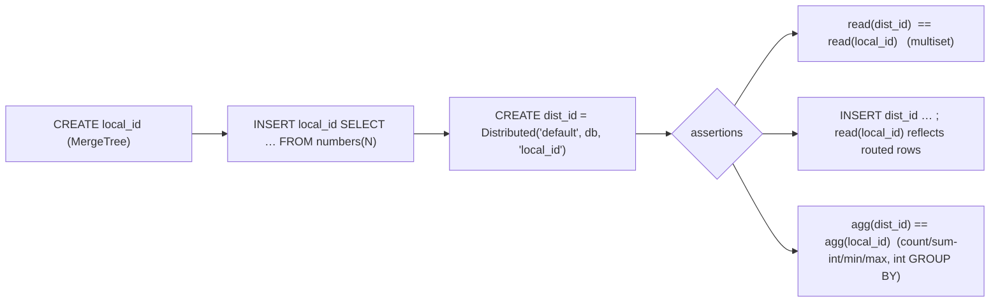

> **Implemented & validated 2026-06-16** on dev-vm `release-radar`, head 26.6.1.886/888.
> All five units shipped. dev-vm smoke (SampleClause+DistributedTable, 91,674 queries):
> 0 reproducers, 0 worker deaths. Config: all 10 targeted `system.*_log` tables confirmed
> absent, `query_log`/`text_log`/`part_log`/`error_log` kept. SampleClause emitted 180k SAMPLE
> queries 0-FP. DistributedTable read/aggregation arms 0-FP; insert-routing arm had a Code-27
> SETTINGS-placement bug (caught by smoke, fixed in `1b38cbcb`) and now executes (6,056 successful
> foreground inserts, 0-FP). Commits: `6392899a` (Phase 3), `147a1e86` (Phases 1–2), `1b38cbcb` (fix).

# feat: ClickHouse SAMPLE clause, Distributed-table support, and server tuning

## Overview

Three independent ClickHouse coverage/operational improvements for this SQLancer fork, bundled
because they were requested together but delivered as separate phases:

1. **SAMPLE clause** — broaden table-level `SAMPLE BY` generation and add a dedicated, *sound*
   oracle that issues query-level `SAMPLE` / `SAMPLE … OFFSET` and checks its invariants. Targets
   the failure class in ClickHouse-private issue #61046.
2. **Distributed tables** — add a dedicated oracle that creates a local MergeTree + a
   `Distributed('default', db, local)` wrapper and asserts read/insert/aggregation equivalence
   through the distributed layer.
3. **Server tuning** — disable additional heavy `system.*_log` tables (beyond the already-disabled
   `trace_log`) in the server-start config set to reduce disk pressure during long fuzz runs.

Each phase is shippable on its own; there are no cross-phase dependencies.

## Problem Frame

- **SAMPLE:** ClickHouse `SAMPLE` is a sampling-key-based approximate read. Issue #61046 is a
  SAMPLE-clause failure class (private; treated here as "SAMPLE-path crashes / wrong-results").
  The fork already emits `SAMPLE BY` on a narrow slice of tables (only when ORDER BY is exactly one
  bare `UInt*` column — `ClickHouseTableGenerator.java:162,191-194`) but **never issues a
  query-level `SAMPLE`**, so the entire read-time sampling path is unfuzzed. SAMPLE is
  non-deterministic (returns an approximate subset), so it cannot be injected into the general
  differential/equivalence fleet (TLP/NoREC/EET) without false positives — it needs a dedicated
  oracle that only asserts invariants that hold under sampling.
- **Distributed:** The fork has no Distributed-engine coverage. `Distributed` wraps an underlying
  local table and routes reads/writes through the distributed layer; on a single node over the
  existing `default` cluster, a Distributed read of a wrapped table must equal a direct read of the
  underlying local table (multiset). The `ClickHouseRemoteLocalEquivalenceOracle` already proves
  the `remote()`/`cluster('default', …)` table-function path works on this single-node setup, so a
  persistent-Distributed-table oracle is a natural, low-risk extension.
- **Tuning:** Long runs accumulate `system.*_log` tables that are pure overhead under fuzz pressure.
  `trace_log` is fully disabled and `processors_profile_log` is TTL-capped, but `metric_log`,
  `asynchronous_metric_log`, `query_metric_log`, and several rarely-used logs still accumulate and
  are only truncated *between* runs by `.claude/clickhouse-disk-cleanup.sh`. Disabling them at
  startup removes the writes entirely.

## Requirements Trace

- **R1.** Table-level `SAMPLE BY` is generated for a meaningfully wider set of tables than today,
  and every emitted `SAMPLE BY` expression is guaranteed to be part of the primary key (CH rejects
  otherwise).
- **R2.** A dedicated `SampleClause` oracle issues query-level `SAMPLE k` / `SAMPLE k OFFSET m` and
  asserts only sampling-sound invariants — zero false positives on a clean head.
- **R3.** Query-level `SAMPLE` is **never** emitted by the general fleet (TLP/NoREC/EET/etc.), so
  no existing oracle gains a sampling-induced false positive.
- **R4.** A dedicated `DistributedTable` oracle creates a `Distributed` wrapper over a local table
  and asserts distributed-read == local-read (multiset), insert-through routing, and aggregation
  equivalence — zero false positives on a clean head.
- **R5.** `Distributed` is **not** added to the general engine pool (oracles assume MergeTree-family
  semantics; inserts and FINAL/sampling differ for Distributed).
- **R6.** The server-start config set disables additional heavy `system.*_log` tables at startup
  via the documented `remove="remove"` mechanism, while preserving the diagnostic logs
  (`query_log`, `text_log`, `part_log`) that reproducer triage depends on.
- **R7.** Each new oracle is registered with an option flag and wired into `--oracles all`, matching
  the existing factory/options pattern.

## Scope Boundaries

- **Non-goal:** Multi-node / sharded Distributed fuzzing. The work stays single-node over the
  existing `default` cluster (one shard, one replica = localhost). No cluster-topology config.
- **Non-goal:** Injecting `SAMPLE` into the general AST/visitor path for the broad fleet. The
  query-level `SAMPLE` lives only in the dedicated oracle, built as raw SQL (the MV / remote-oracle
  pattern), so `ClickHouseSelect` / `ClickHouseToStringVisitor` need no general-fleet change.
- **Non-goal:** Replacing `.claude/clickhouse-disk-cleanup.sh`. Startup-disable and between-run
  truncation are complementary; the cleanup script's truncate list stays (harmless `IF EXISTS`).
- **Non-goal:** Removing `query_log` / `text_log` / `part_log` — they are triage inputs.
- **Non-goal:** Re-deriving #61046's exact statement (private issue). The oracle targets the general
  SAMPLE-read surface; if the issue's specific shape is known to the implementer, add it as one arm.

## Context & Research

### Relevant Code and Patterns

- **SAMPLE BY generation (exists, narrow):** `src/sqlancer/clickhouse/gen/ClickHouseTableGenerator.java`
  - `start()` lines 158-194: ORDER BY emission sets `sampleByColumn = bareIntegerColumnName(expr)`
    (line 162) — non-null **only when the entire ORDER BY expr is one bare UInt* column ref**;
    line 191-194 emits `SAMPLE BY <col>` with 50% probability when set.
  - `isValidSampleBy(expr)` (lines 553-555) and `bareIntegerColumnName(expr)` (lines 557-577,
    accepts `UInt8/16/32/64`, rejects Nullable/LowCardinality/Array) are the existing reusable
    validators.
  - `isBareKeyColumn` (lines 241-250), `fallbackSampleColumn(...)`, `fallbackOrderBy` are the
    existing key-selection helpers to mirror.
- **Table metadata:** `src/sqlancer/clickhouse/ClickHouseSchema.java`
  - `ClickHouseTable` (lines 419-444) carries `engine` + `supportsFinal()`. **No sampling-key
    field** — needs one for the oracle to find sampleable tables.
  - `fromConnection(...)` (lines 446-463) builds tables from `system.tables`; `getTableEngines(...)`
    (lines 465-478) already issues `SELECT name, engine FROM system.tables`. Extend that query to
    also read `sampling_key`.
  - `getRandomTableNonEmptyTables()` (line 411) is the uniform table picker; oracles filter with
    `.filter(t -> !t.isView())`.
- **Self-contained oracle pattern (create own tables, raw SQL, multiset compare):**
  - `src/sqlancer/clickhouse/oracle/view/ClickHouseMaterializedViewConsistencyOracle.java`
    (lines 49-60) — creates `src` + a second object, reads both, compares; has a totals
    precondition that abandons the iteration on environment skew.
  - `src/sqlancer/clickhouse/oracle/tablefn/ClickHouseRemoteLocalEquivalenceOracle.java`
    (lines 98-110) — `remote('127.0.0.1', currentDatabase(), t)` and
    `cluster('default', currentDatabase(), t)` vs local; uses
    `ComparatorHelper.getResultSetFirstColumnAsString(...)` + `assertMultisetsEqual(...)`. **Proves
    the `default` single-node cluster works.**
- **Oracle registration:** `src/sqlancer/clickhouse/ClickHouseOracleFactory.java` (factory enum +
  `--oracles all` wiring), `src/sqlancer/clickhouse/ClickHouseOptions.java` (`@Parameter` flags;
  accessor is `getClickHouseOptions()`, **not** `getOptions()` — see backlog-30 gotchas).
- **Provider/settings:** `src/sqlancer/clickhouse/ClickHouseProvider.java` (lines 110-118
  table-creation loop creating 1-5 tables; lines 166-181 the pinned settings map incl.
  `max_result_rows=1000000`, `result_overflow_mode=throw`).
- **Server config set:** `.claude/run-sqlancer.sh` (lines 127-136 docker run with five `-v` mounts),
  `.claude/clickhouse-config/*.xml` (the `remove="remove"` and TTL patterns),
  `.claude/clickhouse-disk-cleanup.sh` (line 46 — the full heavy-`*_log` truncate list, a ready
  inventory of candidates).

### Institutional Learnings

- **Value-equivalence oracles must compare two forms in ONE query** to dodge the mutation/merge race
  (CLAUDE.md "Authoring rule"). For SAMPLE, subset/identity checks are inherently two reads (sampled
  vs full) of the same table — guard them: `mutations_sync=2` + `async_insert=0` are pinned on the
  dev-vm (already in the config set), and the oracle should additionally pin
  `SYSTEM STOP MERGES`-style determinism or read full+sampled inside one snapshot where possible,
  and abandon the iteration on count skew (MV-oracle precondition precedent).
- **Restrict differential aggregates to exact-integer aggregates / non-float GROUP BY keys**
  (CLAUDE.md "Float false-positive families"). The SAMPLE and Distributed oracles' aggregation arms
  must use `count`/`sum`(integer)/`min`/`max` only.
- **Variant/Dynamic/JSON columns break the binary reader** and multi-branch numeric unions silently
  become `Variant` (CLAUDE.md). New oracles read scalars via `toString(...)`-wrapped projections
  (backlog-30 gotcha) and avoid Variant-typed projections.
- **`remove="remove"`** is the durable mechanism to delete a `<*_log>` block from the parent config;
  TTL via `ALTER … MODIFY TTL` on a system table is non-durable (server re-applies config engine on
  restart) — see `.claude/clickhouse-config/trace_log_disabled.xml` and `system_log_ttl.xml`
  comments.
- **Soundness checklist gate** from the backlog-30 plan applies to both new oracles: verify on head
  with `toTypeName`, run a smoke pass, confirm 0-FP before enabling by default.

### External References

- None required — local patterns are strong (29 oracles shipped on this branch last week; the
  remote/cluster and MV oracles cover the exact construction shapes needed).

## Key Technical Decisions

- **SAMPLE soundness via a dedicated oracle, never the general fleet** (user-selected). Query-level
  `SAMPLE` is emitted only by `ClickHouseSampleClauseOracle`, built as raw SQL. The general
  AST (`ClickHouseSelect`/`ClickHouseToStringVisitor`) is left untouched → structurally impossible
  for TLP/NoREC/EET to gain a sampling FP (R3).
- **Sampling-sound invariants only.** The oracle asserts: (a) `SAMPLE 1` == full read (identity);
  (b) sampled rows ⊆ full rows (subset containment, multiset on the sampling-key projection);
  (c) `SAMPLE k OFFSET m` arms are each ⊆ full and the union of a disjoint OFFSET tiling ⊆ full;
  (d) `_sample_factor` reconstruction: `sum(_sample_factor)` over a sample ≈ full `count()` within a
  tolerance band, **gated/off by default** because it is statistical, not exact (over-tolerance
  risk per code-review hardening precedent). Exact arms (a)-(c) are the default; (d) is opt-in.
- **Record `samplingKey` on `ClickHouseTable`** (read from `system.tables.sampling_key`) so the
  oracle can find schema tables that are sampleable, and fall back to creating its own table when
  none exist (robustness, MV-oracle precedent).
- **Widen `SAMPLE BY` generation** to also fire when a bare `UInt*` column is a *prefix element* of
  a composite ORDER BY (CH requires the sampling expr to be in the primary key; an ORDER BY prefix
  column qualifies), not only when ORDER BY is exactly that single column. Keep the conservative
  validator; just broaden the column-discovery path.
- **Distributed via a dedicated self-contained oracle, not the engine pool** (R5). Each iteration
  creates `local_<id>` (MergeTree) + `dist_<id>` = `Distributed('default', currentDatabase(),
  'local_<id>')`, inserts via `numbers(N)` into the local table, and asserts equivalence. This
  avoids teaching every existing oracle Distributed semantics and avoids Distributed-INSERT routing
  surprises in the general INSERT path.
- **Server tuning via new config.d `remove="remove"` files**, mounted in `run-sqlancer.sh`,
  mirroring `trace_log_disabled.xml`. One file per logical group or a single combined file —
  combined is simpler to mount (one `-v`).

## Open Questions

### Resolved During Planning

- *Should SAMPLE go through the general AST/visitor?* — No. Dedicated oracle, raw SQL (user choice +
  soundness). AST change deferred/optional.
- *Does a usable single-node cluster exist for Distributed?* — Yes, `default` (proven by
  `ClickHouseRemoteLocalEquivalenceOracle` using `cluster('default', …)`).
- *Is SAMPLE BY already generated?* — Yes, but only for single-bare-UInt-column ORDER BY and never
  consumed by a query-level SAMPLE. Workstream = harden + consume.
- *How are sampleable tables discovered?* — Add `samplingKey` to `ClickHouseTable` via
  `system.tables.sampling_key`; fall back to self-created table.

### Deferred to Implementation

- **Exact `SAMPLE`/`FINAL` keyword ordering** in a combined query (`FROM t [FINAL] [SAMPLE k]`) —
  confirm empirically on head before finalizing the oracle's raw-SQL template; CH grammar attaches
  both to the table expression.
- **`_sample_factor` tolerance band** for arm (d) — pick the band after observing variance on head;
  keep the arm gated until 0-FP is demonstrated.
- **Final list of `*_log` tables to disable** — confirm against
  `SELECT name FROM system.tables WHERE database='system' AND name LIKE '%\_log'` on current head;
  the candidate list below is from `clickhouse-disk-cleanup.sh` but head may add/rename logs
  (e.g. `latency_log`).
- **Whether widened SAMPLE BY needs `index_granularity` interaction tuning** — observe whether the
  wider emission trips `allow_suspicious_indices`-adjacent errors; adjust validator if so.
- **Distributed INSERT settings** (`distributed_foreground_insert` / `insert_distributed_sync`) to
  make insert-through-Distributed synchronous for the read-back assertion — set empirically.

## High-Level Technical Design

> *This illustrates the intended approach and is directional guidance for review, not implementation
> specification. The implementing agent should treat it as context, not code to reproduce.*

SAMPLE oracle invariant arms (sound subset, per iteration on a sampleable table `t` with sampling
key `s`):

```
full      = read(SELECT s FROM t ORDER BY s)                 -- multiset ground truth
identity  = read(SELECT s FROM t SAMPLE 1 ORDER BY s)        -- arm (a): MUST equal full
sampled   = read(SELECT s FROM t SAMPLE 0.5)                 -- arm (b): MUST be subset-of full
tiles     = [ SAMPLE 1/k OFFSET i/k  for i in 0..k-1 ]       -- arm (c): each subset-of full;
                                                             --          union also subset-of full
-- arm (d) GATED/off-by-default, statistical:
--   sum(_sample_factor) over a sample  ~=  full count()   within tolerance
assert multiset(identity) == multiset(full)
assert multiset(sampled)  ⊆  multiset(full)
for tile in tiles: assert multiset(tile) ⊆ multiset(full)
```

Distributed oracle (per iteration):



## Implementation Units

> Phases are independent; implement in any order. Within the SAMPLE phase, Units 1→2→3 are ordered.

### Phase 1 — SAMPLE clause

- [x] **Unit 1: Widen and harden table-level `SAMPLE BY` generation**

**Goal:** Emit `SAMPLE BY` for a broader, still-correct set of tables — any case where a bare
`UInt*` column is part of the primary key, not only single-column ORDER BY.

**Requirements:** R1

**Dependencies:** None

**Files:**
- Modify: `src/sqlancer/clickhouse/gen/ClickHouseTableGenerator.java`
- Test: `src/test/java/sqlancer/clickhouse/ClickHouseTableGeneratorSampleTest.java` (new) —
  unit-test the column-discovery helper in isolation if it is extracted to a testable static method;
  otherwise cover via the smoke run in Unit 3's verification.

**Approach:**
- Add a discovery helper that, given the ORDER BY expression(s) actually emitted, returns a bare
  `UInt*` column that is provably in the primary key — accept the single-column case (today) **and**
  the case where the chosen ORDER BY is a tuple/composite whose elements include a bare `UInt*`
  column reference. Reuse `bareIntegerColumnName` per element.
- Keep `SAMPLE BY` emission probability as-is (50% when a key is available); the change is the
  *eligibility* set, not the rate.
- Do **not** invent a sampling key absent from the primary key — that is a CH error, not a finding.

**Patterns to follow:** existing `bareIntegerColumnName` / `fallbackSampleColumn` /
`isBareKeyColumn` in the same file; the `generateValidated(...)` validator style.

**Test scenarios:**
- Happy path: ORDER BY = single `UInt32` column → `SAMPLE BY <col>` may be emitted; the emitted
  column equals the ORDER BY column.
- Happy path: ORDER BY = `(uintCol, strCol)` composite → `SAMPLE BY uintCol` is eligible.
- Edge case: ORDER BY = `tuple()` (no key) → no `SAMPLE BY`.
- Edge case: only `UInt*` column is `Nullable(UInt32)` / `LowCardinality(UInt32)` → not eligible
  (validator rejects).
- Edge case: dedupe engine with bare-key ORDER BY containing a `UInt*` column → eligible, and the
  resulting CREATE TABLE executes without `BAD_ARGUMENTS`.

**Verification:** A short generation smoke (Unit 3) produces multiple tables with `SAMPLE BY` over
composite ORDER BY, all of which `CREATE` successfully on head; no `Sampling expression must be
present in the primary key`-class errors.

- [x] **Unit 2: Record `samplingKey` on `ClickHouseTable`**

**Goal:** Let oracles discover which existing schema tables are sampleable.

**Requirements:** R2 (enabler)

**Dependencies:** None (independent of Unit 1; both feed Unit 3)

**Files:**
- Modify: `src/sqlancer/clickhouse/ClickHouseSchema.java`

**Approach:**
- Extend the engine-discovery query in `getTableEngines(...)` (or add a sibling) to
  `SELECT name, engine, sampling_key FROM system.tables WHERE database = '…'`.
- Add a `samplingKey` field (String, empty when none) + getter to `ClickHouseTable`, populated in
  `fromConnection(...)`. Add a convenience `boolean hasSamplingKey()`.
- No change to `getRandomTableNonEmptyTables()`; the oracle filters on `hasSamplingKey()`.

**Patterns to follow:** the existing `engine` field + `getTableEngines` map in the same file;
mirror its escaping (`databaseName.replace("'", "''")`).

**Test scenarios:**
- Integration: create a table with `SAMPLE BY` → after schema refresh, `hasSamplingKey()` is true
  and `getSamplingKey()` is non-empty.
- Integration: create a plain MergeTree without `SAMPLE BY` → `hasSamplingKey()` is false.
- Edge case: a view → `hasSamplingKey()` false (no sampling_key in system.tables).

**Verification:** Oracle in Unit 3 can enumerate sampleable schema tables; logged count > 0 across a
smoke run that includes Unit 1's widened generation.

- [x] **Unit 3: `ClickHouseSampleClauseOracle` (dedicated, sound)**

**Goal:** Issue query-level `SAMPLE` / `SAMPLE … OFFSET` and assert sampling-sound invariants;
register it behind a flag.

**Requirements:** R2, R3, R7

**Dependencies:** Unit 2 (table discovery); benefits from Unit 1 (more sampleable tables)

**Files:**
- Create: `src/sqlancer/clickhouse/oracle/sample/ClickHouseSampleClauseOracle.java`
- Modify: `src/sqlancer/clickhouse/ClickHouseOracleFactory.java` (register + `--oracles all`)
- Modify: `src/sqlancer/clickhouse/ClickHouseOptions.java` (`--sample-clause-oracle`,
  `--sample-factor-arm` gated/default-false)
- Test: `src/test/java/sqlancer/clickhouse/ClickHouseSampleClauseOracleTest.java` (new) — unit-test
  the invariant comparator (subset/identity logic) against synthetic row lists; full behavior
  covered by smoke (Verification).

**Approach:**
- Pick a sampleable table via `hasSamplingKey()`; if none, self-create `samp_<AtomicLong>` (MergeTree
  with `ORDER BY u`, `SAMPLE BY u` over a `UInt32 u`) and fill via `INSERT … SELECT … FROM
  numbers(N)` (raise `max_partitions_per_insert_block` per the replay note if partitioned).
- Build **raw SQL** (remote/MV-oracle style). Arms:
  - (a) identity: `SELECT <key> FROM t SAMPLE 1 ORDER BY <key>` == `SELECT <key> FROM t ORDER BY
    <key>` (multiset).
  - (b) subset: `SELECT <key> FROM t SAMPLE 0.5` ⊆ full multiset of `<key>`.
  - (c) OFFSET tiling: a few `SAMPLE 1/k OFFSET i/k` arms, each ⊆ full; their union ⊆ full.
  - (d) `_sample_factor` reconstruction — **gated** behind `--sample-factor-arm` (default false),
    tolerance band TBD.
- Combine occasionally with `FINAL` (when `supportsFinal()`) and `PREWHERE`/`WHERE` to widen the
  surface, but keep ground truth = the same predicate without `SAMPLE`.
- Tolerate the same global error set; **abandon the iteration** (not assert) on count skew that
  indicates an in-flight merge/mutation (MV-oracle precondition precedent).
- Read scalars via `toString(...)`-wrapped projection; integer/sampling-key columns only.

**Execution note:** Implement the invariant comparator test-first; it is pure logic and the highest
FP-risk surface.

**Patterns to follow:** `ClickHouseRemoteLocalEquivalenceOracle` (raw SQL + `ComparatorHelper` +
`assertMultisetsEqual`/subset helper), `ClickHouseMaterializedViewConsistencyOracle` (self-contained
table + abandon-on-skew precondition).

**Test scenarios:**
- Happy path: `SAMPLE 1` returns exactly the full multiset → arm (a) passes.
- Happy path: `SAMPLE 0.5` returns a strict subset → arm (b) passes (subset, not equality).
- Edge case: empty table → all arms vacuously pass (no assertion, iteration abandoned or skipped).
- Edge case: table with all-identical sampling-key values → sample is still ⊆ full.
- Error path: table without a sampling key is never selected (guarded by `hasSamplingKey()` / falls
  back to self-created table).
- Error path: in-flight merge produces transient count skew → iteration abandoned, no assertion.
- Integration: oracle registered in factory appears under `--oracles all` and runs without
  ClassNotFound/flag-wiring errors.
- Soundness (smoke): 1h dev-vm full-fleet run with the oracle on → **0 false positives** from
  `ClickHouseSampleClauseOracle`; any SAMPLE-path `LOGICAL_ERROR`/crash is a genuine #61046-class
  finding.

**Verification:** Builds; `--oracles all` includes it; dev-vm smoke shows the oracle firing
(non-zero SAMPLE queries in query_log) with 0 FP on arms (a)-(c); arm (d) stays off unless
explicitly enabled.

### Phase 2 — Distributed tables

- [x] **Unit 4: `ClickHouseDistributedTableOracle` (dedicated, self-contained)**

**Goal:** Fuzz the Distributed-engine read/insert/aggregation path on the single-node `default`
cluster and assert equivalence to the underlying local table.

**Requirements:** R4, R5, R7

**Dependencies:** None (self-contained; does not depend on the SAMPLE phase)

**Files:**
- Create: `src/sqlancer/clickhouse/oracle/distributed/ClickHouseDistributedTableOracle.java`
- Modify: `src/sqlancer/clickhouse/ClickHouseOracleFactory.java` (register + `--oracles all`)
- Modify: `src/sqlancer/clickhouse/ClickHouseOptions.java` (`--distributed-table-oracle`)
- Test: `src/test/java/sqlancer/clickhouse/ClickHouseDistributedTableOracleTest.java` (new) —
  unit-test the multiset comparator usage / SQL templating; full behavior via smoke.

**Approach:**
- Per iteration: `CREATE TABLE local_<id> (…) ENGINE = MergeTree ORDER BY …`; fill via
  `INSERT … SELECT … FROM numbers(N)`; `CREATE TABLE dist_<id> AS local_<id> ENGINE =
  Distributed('default', currentDatabase(), 'local_<id>')` (or explicit column list).
- Assertions (multiset, scalars via `toString(tuple(*))` like the remote oracle):
  - read equivalence: `SELECT … FROM dist_<id>` == `SELECT … FROM local_<id>`.
  - insert routing: `INSERT INTO dist_<id> …` (with synchronous distributed-insert settings), then
    `SELECT … FROM local_<id>` reflects the routed rows.
  - aggregation pushdown: `count()`, `sum(<intCol>)`, `min`/`max`, `GROUP BY <intCol>` equal between
    `dist_<id>` and `local_<id>` (exact-integer aggregates only — float/GROUP-BY-float forbidden).
- Tolerate the global error set; abandon on environment skew. Drop `dist_<id>`/`local_<id>` or rely
  on per-run DB teardown (cleanup script drops orphan DBs).
- **Do not** modify `pickEngine` (R5).

**Patterns to follow:** `ClickHouseRemoteLocalEquivalenceOracle` (the `cluster('default', …)` proof
that the cluster works; `assertMultisetsEqual`; `toString(tuple(*))` projection),
`ClickHouseMaterializedViewConsistencyOracle` (self-contained create + abandon-on-skew).

**Test scenarios:**
- Happy path: Distributed read of a wrapped table == local read (multiset) for a multi-row table.
- Happy path: `INSERT INTO dist_…` then local read reflects the rows (synchronous insert).
- Happy path: `count()`/`sum(int)`/`GROUP BY int` equal across dist vs local.
- Edge case: empty local table → dist read empty; assertions vacuously hold.
- Edge case: single-row table → equivalence holds.
- Error path: insert routing with async distributed insert would race → use synchronous settings;
  if skew detected, abandon iteration (no FP).
- Error path: a genuine Distributed `LOGICAL_ERROR`/crash surfaces as a finding (not tolerated).
- Integration: registered under `--oracles all`; runs without wiring errors.
- Soundness (smoke): 1h dev-vm full-fleet run → 0 false positives from the Distributed oracle.

**Verification:** Builds; appears under `--oracles all`; dev-vm smoke shows Distributed queries in
query_log with 0 FP; cleanup leaves no orphan `local_*`/`dist_*` tables after DB drop.

### Phase 3 — Server tuning

- [x] **Unit 5: Disable additional heavy `system.*_log` tables at startup**

**Goal:** Remove unnecessary `system.*_log` writes at server start to cut disk pressure on long
runs, preserving diagnostic logs.

**Requirements:** R6

**Dependencies:** None

**Files:**
- Create: `.claude/clickhouse-config/system_logs_disabled.xml` (one combined file with multiple
  `<*_log remove="remove"/>` entries — single mount)
- Modify: `.claude/run-sqlancer.sh` (add one `-v` mount into `config.d/` as `sf_system_logs_disabled.xml`)
- Modify: `.claude/CLAUDE.md` (update the "Required config set" note + the docker-run snippet to list
  the new mount and the now-six-file set)
- Test expectation: none — config/ops change; verified operationally (Verification below), no unit test.

**Approach:**
- Mirror `trace_log_disabled.xml`: `<clickhouse><metric_log remove="remove"/> …</clickhouse>`.
- **Disable** (heavy, non-diagnostic): `metric_log`, `asynchronous_metric_log`, `query_metric_log`,
  `processors_profile_log` (promote from TTL-cap to full remove — drop its entry from
  `system_log_ttl.xml` to avoid a dangling override), `opentelemetry_span_log`, `query_views_log`,
  `query_thread_log`, `backup_log`, `blob_storage_log`, plus any head-only heavy log confirmed
  present (e.g. `latency_log`). Confirm the exact set against head (see Deferred).
- **Keep** (diagnostic, do not remove): `query_log`, `text_log`, `part_log`, `error_log`.
- Keep `.claude/clickhouse-disk-cleanup.sh` truncate list unchanged (`IF EXISTS` makes
  now-absent tables harmless).
- Note in CLAUDE.md that `processors_profile_log` moved from TTL to `remove`, and why
  `query_thread_log` is now disabled (heavy; `query_log` retains the per-query triage data).

**Patterns to follow:** `.claude/clickhouse-config/trace_log_disabled.xml` (`remove="remove"` +
explanatory header comment), the existing five-mount block in `.claude/run-sqlancer.sh:127-136`,
and the `sf_`-prefix mount-naming convention.

**Test scenarios:** Test expectation: none — operational change. Verified by the checks below.

**Verification:**
- Start the server via `run-sqlancer.sh` on the dev-vm; `SELECT name FROM system.tables WHERE
  database='system' AND name LIKE '%\_log'` shows the disabled tables **absent** and the kept ones
  **present**.
- Server starts cleanly (no config-merge error in `clickhouse-server.err.log`; a typo'd table name
  is silently ignored by `remove`, so cross-check the absence list explicitly).
- A 15-min fuzz run shows lower data-dir growth than a baseline run (qualitative; the disabled logs
  contribute no parts).
- A reproducer triage still works: `query_log` and `text_log` retain the failing query + thread
  context.

## System-Wide Impact

- **Interaction graph:** New oracles plug into `ClickHouseOracleFactory` + `--oracles all`; no change
  to the general fleet's query construction. The SAMPLE phase touches the shared
  `ClickHouseTableGenerator` (Unit 1) and `ClickHouseSchema` (Unit 2) — both additive (wider
  eligibility, new field), so existing oracles see strictly the same or more tables, never fewer.
- **Error propagation:** New oracles inherit the global tolerated-error set (`ClickHouseErrors`);
  genuine SAMPLE/Distributed `LOGICAL_ERROR`s/crashes propagate as findings. Both oracles
  *abandon* (not assert) on environment-induced count skew.
- **State lifecycle risks:** Distributed insert routing and SAMPLE's two-read invariants are
  snapshot-sensitive; mitigated by the pinned `async_insert=0` + `mutations_sync=2` config, synchronous
  distributed-insert settings, and abandon-on-skew preconditions.
- **API surface parity:** Both new flags follow the existing `@Parameter` + factory pattern;
  `getClickHouseOptions()` accessor (not `getOptions()`).
- **Integration coverage:** Schema-refresh reading `sampling_key` (Unit 2) and Distributed
  create/insert/read (Unit 4) are cross-layer and proven only by the dev-vm smoke runs, not unit
  tests.
- **Unchanged invariants:** `pickEngine` engine pool is **not** modified (Distributed stays out of
  it, R5); `ClickHouseSelect`/`ClickHouseToStringVisitor` are **not** modified (SAMPLE stays out of
  the general AST, R3); `query_log`/`text_log`/`part_log` remain enabled (R6).

## Risks & Dependencies

| Risk | Mitigation |
|------|------------|
| SAMPLE oracle false positives from sampling non-determinism | Assert only sound invariants (identity/subset/OFFSET-subset); statistical `_sample_factor` arm gated off by default; abandon-on-skew; mandatory 0-FP smoke gate before default-on. |
| Widened `SAMPLE BY` emits a sampling key not in the primary key → CH error | Discovery helper only returns columns provably in the emitted ORDER BY/primary key; conservative validator retained. |
| Distributed insert race makes read-back skew → FP | Synchronous distributed-insert settings; multiset compare; abandon on skew (MV-oracle precedent). |
| Disabling a log that triage actually needs | Explicit keep-list (`query_log`/`text_log`/`part_log`/`error_log`); CLAUDE.md documents the rationale; cleanup script unchanged. |
| `remove="remove"` silently ignores a typo'd table name (no error) | Verification explicitly asserts the *absence* list via `system.tables`, not just clean startup. |
| Head renames/adds a `*_log` table | Confirm the disable set against head before finalizing (Deferred question). |
| New oracles drown a run in noise (cf. RowPolicy/Direct-read floods) | Default-on only after 0-FP smoke; exclude from 20h runs if they orphan DBs (cf. TextIndexDirectRead lesson); keep arms gated where statistical. |

## Documentation / Operational Notes

- Update `.claude/CLAUDE.md`: the "Required config set" section (five → six files; note
  `processors_profile_log` moved TTL→remove and `query_thread_log` disabled), and the docker-run
  reference snippet.
- Update the engine-pool / oracle inventory notes if the project keeps a running oracle count
  (the backlog-30 memory file lists "29 new oracles"; this adds 2 → 31).
- After validation, add a memory file pointer for the SAMPLE + Distributed oracles and the tuning
  change (per the repo's memory convention), and note the #61046 linkage next to the SAMPLE oracle.

## Sources & References

- Request: SAMPLE clause (table + query level) for ClickHouse-private #61046; Distributed-table
  support; server tuning (disable `metric_log`/`trace_log`/others).
- Related code: `src/sqlancer/clickhouse/gen/ClickHouseTableGenerator.java`,
  `src/sqlancer/clickhouse/ClickHouseSchema.java`,
  `src/sqlancer/clickhouse/oracle/tablefn/ClickHouseRemoteLocalEquivalenceOracle.java`,
  `src/sqlancer/clickhouse/oracle/view/ClickHouseMaterializedViewConsistencyOracle.java`,
  `src/sqlancer/clickhouse/ClickHouseOracleFactory.java`, `src/sqlancer/clickhouse/ClickHouseOptions.java`,
  `.claude/run-sqlancer.sh`, `.claude/clickhouse-config/trace_log_disabled.xml`,
  `.claude/clickhouse-disk-cleanup.sh`.
- Prior plans: `docs/plans/2026-06-13-001-feat-clickhouse-coverage-backlog-30-ideas-plan.md`
  (oracle authoring conventions, soundness checklist, factory/options wiring).
